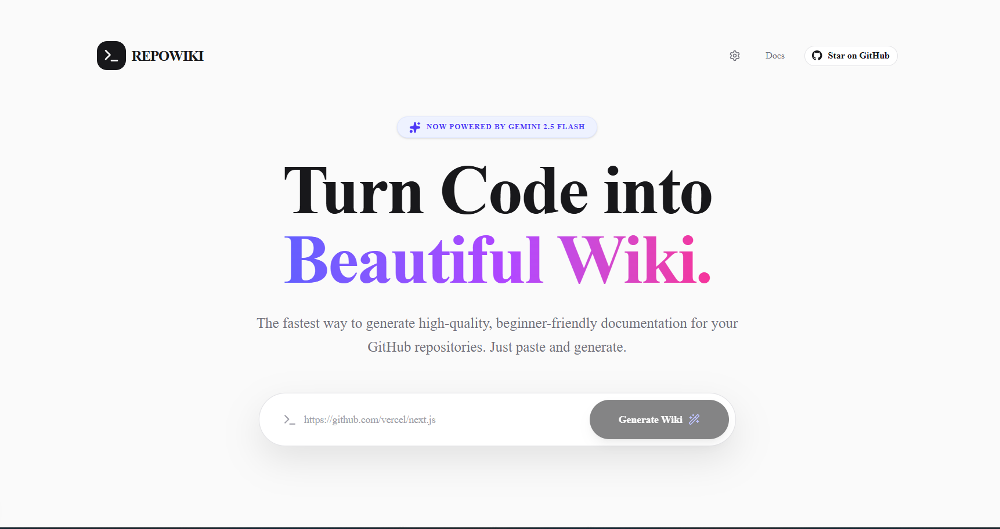

# RepoWiki 🚀

RepoWiki is a modern, AI-powered web application that takes any public (or private!) GitHub repository URL and instantly generates beautiful, Notion-style documentation wikis.

Built on **Next.js 14+**, **Tailwind CSS**, and **Vercel AI SDK**, RepoWiki leverages the **Gemini 2.5 Flash** model to analyze a repository's `README.md`, `package.json`, and file structure to heuristically deduce its architecture and provide step-by-step documentation, including embedded Mermaid.js diagrams.

 <!-- Note: Add an actual screenshot to your public folder -->

## Features
- ✨ **Instant Documentation**: Just paste a GitHub URL.
- 🔒 **Private Repo Support**: Bring your own GitHub token to analyze proprietary codebases.
- ⚡ **Streamed Responses**: Watch the documentation generate in real-time.
- 🎨 **Premium Aesthetic**: Clean UI, dark mode, Framer Motion animations.
- 💾 **Static Export**: Download the generated HTML as a standalone, styled file.

---

## 🛠️ Tech Stack
- Frontend: Next.js (App Router), React, Tailwind CSS, Framer Motion
- UI Components: Shadcn UI, Lucide React
- Backend: Vercel AI SDK (`@ai-sdk/google`, `@ai-sdk/react`)
- Data Provider: `octokit` (GitHub REST API)
- AI Model: Google Gemini 2.5 Flash

---

## 🚀 Getting Started (Local Development)

### Prerequisites
- Node.js (v18+)
- A Google AI SDK (Gemini) API Key

### 1. Clone the repository
```bash
git clone https://github.com/yourusername/repo-to-wiki.git
cd repo-to-wiki
npm install
```

### 2. Environment Setup
Copy the example environment file:
```bash
cp .env.example .env.local
```

Fill in your `.env.local` file. 
*Note: The `GITHUB_TOKEN` is technically optional, but highly recommended so your server does not hit rate limits when processing public repositories.*

```env
GITHUB_TOKEN=your_fine_grained_github_token_here
GEMINI_API_KEY=your_gemini_api_key_here
```

### 3. Start the Development Server
```bash
npm run dev
```
Open [http://localhost:3000](http://localhost:3000) in your browser.

---

## 🔐 Security & Architecture: Bring Your Own Keys (BYOK)

RepoWiki is designed to be fully serverless without a database. Because API limits can be restrictive, this app features a **"Bring Your Own Key" (BYOK) Architecture**.

If you provide this app to your users, they can click the **Settings (Gear Icon)** in the UI to input their own API keys. 

**Why is this amazing?**
1. **Private Repositories**: If users input their own GitHub token in the UI, RepoWiki will utilize it to securely analyze their *private* codebases!
2. **Rate Limits**: Heavy users bypass your server's `.env.local` limits and consume their own quotas.
3. **Privacy**: User keys are saved **locally in the browser (`localStorage`)** and are never saved to a database.

---

## 🔑 How to Create a Safe, Fine-Grained GitHub Token

When testing or deploying this, it is recommended to use a **Fine-Grained Personal Access Token (PAT)** rather than a classic token. It is much more secure.

1. Go to your GitHub account: **Settings** > **Developer Settings** > **Personal access tokens** > **Fine-grained tokens**.
2. Click **Generate new token**.
3. **Repository access:** Select `Public Repositories (read-only)`. (If you are entering it in the UI to scan a private repo, grant access to `All repositories` or `Only select repositories`).
4. **Permissions:** 
   - Under **Repository permissions**, ensure `Contents` and `Metadata` are set to **Read-only**.
5. Save and copy the token. It should start with `github_pat_...`
6. Paste it into your `.env.local` or directly into the RepoWiki UI Settings Modal!

---

## Contributing
Contributions, issues, and feature requests are welcome! Feel free to check [issues page](https://github.com/yourusername/repo-to-wiki/issues).

## License
MIT License
